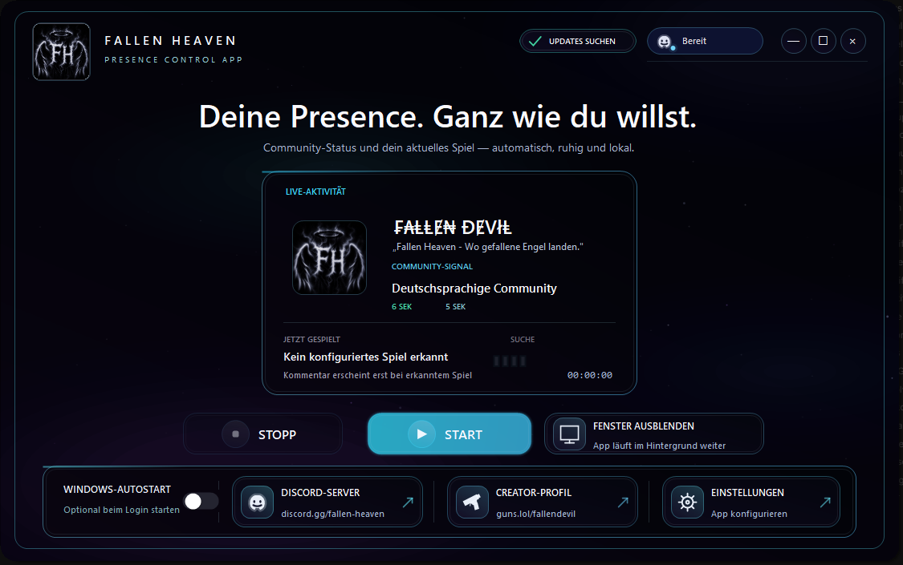
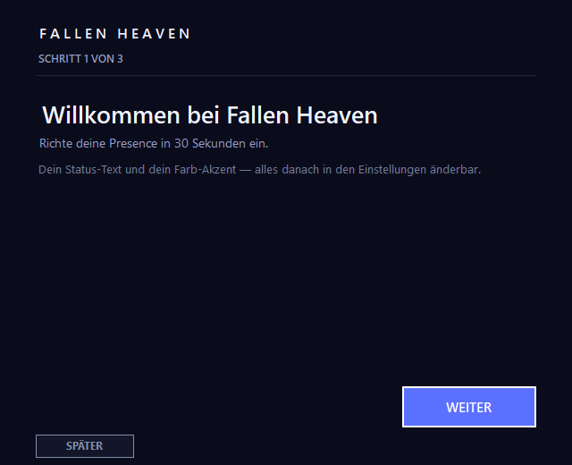

# FALLEN HEAVEN — Your Discord status, your way

> "Where fallen angels land" — turn your Discord status into something that's truly yours. Show games, music, or your Discord server right in your profile. Simple, local, no installation required.

*Deutsche Version: [README.md](README.md)*

---

## 📑 Table of contents

- [What is FALLEN HEAVEN?](#-what-is-fallen-heaven)
- [A look at the app](#-a-look-at-the-app)
- [Requirements](#-requirements)
- [Quick start](#-quick-start-2-minutes)
- [Your status, your text](#-your-status-your-text)
- [Languages](#-languages)
- [Features](#-features)
- [Privacy](#-privacy)
- [Updates](#-updates)
- [FAQ](#-faq)
- [Version history](#-version-history)
- [Community & support](#-community--support)
- [License](#-license)

---

## 🌟 What is FALLEN HEAVEN?

A small, portable Windows app that styles your Discord status automatically:

- 🎮 **Games** — recognized games appear with their icon
- 🎧 **Music** — Spotify song, artist, and cover
- ▶️ **YouTube & Twitch** — videos and streams with title and image
- ✍️ **Your text** — a motto, a message, or server advertising
- 🔘 **Buttons** — up to 2 clickable buttons with your own name and link

Everything runs **locally** on your PC — no account, no tracking, nothing is uploaded.

---

## 📸 A look at the app

*The dashboard: your status, games, music, and buttons — all at a glance.*

*First launch: the app walks you through the setup step by step.*

---

## ✅ Requirements

- **Windows 10 or 11**
- **Discord desktop app** — installed and running

---

## 🚀 Quick start (2 minutes)

1. **Download the app** — the latest version is under [Releases](https://github.com/fallendevilsys/Fallen-Heaven/releases). The app is **portable**: just run it, no installation.
2. **Enter your Client ID** (once):
   - Open the [Discord Developer Portal](https://discord.com/developers/applications)
   - **New Application** → choose a name
   - Copy the **Application ID (Client ID)**
   - Paste it into the app: **Settings → Client ID**
3. **Press START** — your status appears in your profile instantly.

> 💡 Without your own Client ID, Discord won't show a status. The app walks you through the setup step by step.

---

## ✍️ Your status, your text

You decide what others see:

- **Main text** — the large text above your status
- **Status lines** — up to 3 lines that rotate automatically
- **Comment** — a short text shown with a detected game
- **Buttons** — up to 2 buttons with your own name and link

**How to advertise your Discord server:**

1. Open **Settings → Status**
2. **Main text**: e.g. `Our Discord — where it all happens`
3. **Status lines**: e.g. `Daily events`, `Friendly community`
4. **Buttons**: e.g. "My Server" with your invite link and "My Profile" with your link
5. **Save** — done.

> 💡 **Note:** You won't see your own buttons in your profile (a Discord limitation) — **other users** see them.

**Built in** (not changeable): the FH logo, the glitch title "BY ₣₳ⱠⱠɆ₦ ĐɆVłⱠ", the "DISCORD-SERVER" and "CREATOR-PROFIL" buttons, and the verified badge. Everything else — text, status, buttons, and images — is yours.

---

## 🌍 Languages

The app is fully translated and switches languages automatically based on your Windows system language — you can also change it manually anytime in the settings:

- 🇩🇪 **German**
- 🇬🇧 **English**
- 🇪🇸 **Spanish**
- 🇫🇷 **French**
- 🇷🇺 **Russian**
- 🇸🇦 **Arabic**

---

## ✨ Features

- 🎮 **Game detection** — automatic, including your own game rules
- 🎧 **Spotify** — song, artist, and cover, taking priority over the browser
- ▶️ **YouTube & Twitch** — title, channel, and preview image
- ✍️ **Your own text** — main text, rotating lines, comment, up to 2 buttons
- 👤 **Your own Client ID** — up to 2 supported
- 🔒 **Privacy mode** — a neutral display while OBS & co. are running
- 🌍 **6 languages** — German, English, Spanish, French, Russian, and Arabic
- 🎨 **Color themes** — Violet, Neon Cyan, Crimson, Cyberpunk
- 🖥️ **Fits every screen** — everything stays visible even on small monitors
- 🚀 **Automatic updates**
- 🪟 **Background & autostart** — keeps running invisibly in the tray

---

## 🔒 Privacy

Everything runs **locally**. The app only connects to **Discord** and — only when enabled — to **YouTube/Twitch**. Games, Spotify, and browsers are detected locally. Updates come via the public GitHub release.

---

## 🔄 Updates

New versions are downloaded and installed **automatically** on startup — you don't have to do anything. Manually: **CHECK FOR UPDATES**.

---

## ❓ FAQ

**Why don't I see a status?**
Almost always a missing Client ID — see [Quick start](#-quick-start-2-minutes).

**Why can't I see my own buttons?**
Discord only shows buttons to other users. Test with a second account.

**The app doesn't detect my game?**
Create your own game rule: **Settings → Game detection**.

**Can the app run in the background?**
Yes — "Hide window" keeps it running invisibly in the tray.

**Where are my settings stored?**
Locally in the app folder. The app is portable — just copy the folder.

---

## 📜 Version history

**6.3.6** *(current)*
- 🎧 **Improved Spotify recognition** — songs, artists, and covers are detected more reliably and shown automatically in your Discord status.
- 🐛 **Bug fixes** — smaller detection and display issues have been resolved.
- ✨ **More everyday reliability** — the app is more stable and dependable in daily use.

**6.3.5**
- 🌍 **9 languages available** — Turkish, Italian, and Polish have been added.
- 🚩 **Correct language flags** — each language now displays its matching flag.
- 💬 **Fully translated interface** — dialogs and messages are available in all supported languages.
- 🛠️ **Improvements and stability fixes** — the app runs more reliably in everyday use.
- ✨ **Improved startup animation** — softly glowing particles and a pulsing logo make startup feel smoother.

**6.3.4**
- 🖥️ **Fits every screen** — the app shrinks windows automatically on small monitors so nothing gets cut off.
- 🔍 **Crisp text everywhere** — no more blurry text on laptops with 125%/150% zoom.

**6.3.3**
- 🎨 **Color themes** — choose between Violet, Neon Cyan, Crimson, and Cyberpunk.
- 🚀 **More reliable updates** — new versions install cleanly and restart the app automatically.

**6.3.2**
- 🎮 **Detection improved** — games, browsers, and YouTube are recognized reliably again.

**6.3.1**
- ⚡ **Saved instantly** — changes apply without restarting; your status stays active.
- 🛠️ **More stable** — settings can always be saved reliably.

**6.3.0**
- 🐛 **Bug fixes** — minor issues fixed and the app made more stable.

---

## 💬 Community & support

Questions, feedback or ideas? Join the community:

- 💬 [Discord server](https://discord.gg/fallen-heaven)
- 🎮 [Creator profile](https://guns.lol/fallendevil)

---

## 📄 License

**All rights reserved** — see [LICENSE](LICENSE). Copying, distribution or resale only with explicit written permission.
